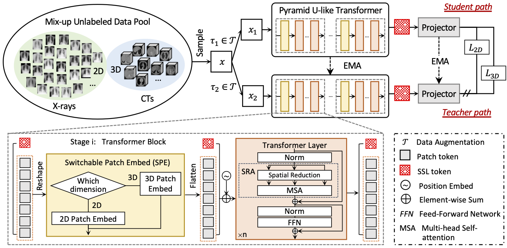

# UniMiSS-code
This is the official pytorch implementation of our ECCV 2022 paper "UniMiSS: Universal Medical Self-Supervised Learning via Breaking Dimensionality Barrier". In this paper, we advocate bringing a wealth of 2D images like chest X-rays as compensation for the lack of 3D data, aiming to build a universal medical self-supervised representation learning framework, called UniMiSS. We conduct expensive experiments on six 3D/2D medical image analysis tasks, including segmentation and classification. The results show that the proposed UniMiSS achieves promising performance on various downstream tasks, outperforming the ImageNet pre-training and other advanced SSL counterparts substantially.

<div align="center">
  
</div>

## Requirements
CUDA 11.0<br />
Python 3.7<br /> 
Pytorch 1.7.1<br /> 
Torchvision 0.8.2<br />


## Usage

### 0. Installation
* Create virtual environment
```
conda create --name UniMiSS python=3.7
conda activate UniMiSS
```

* Install dependencies as below
  
```
pip install torch==1.7.1+cu110 torchvision==0.8.2+cu110 torchaudio==0.7.2 -f https://download.pytorch.org/whl/torch_stable.html
pip install batchgenerators==0.21
pip install dicom2nifti==2.3.0
pip install matplotlib==3.4.2
pip install ml-collections==0.1.0
pip install nibabel==3.2.1
pip install numpy==1.19.5
pip install opencv-python==4.5.2.52
pip install Pillow==8.2.0
pip install pydicom==2.1.2
pip install scikit-image==0.18.1
pip install scikit-learn==0.24.2
pip install scipy==1.6.3
pip install SimpleITK==1.2.4
pip install sklearn==0.0
pip install tensorboard==2.5.0
pip install torchio==0.18.39
pip install timm
```

### 1. Data Preparation
* cd UniMiSS/data
* Download [MOTS data](https://www.synapse.org/#!Synapse:syn3193805/wiki/217789), [LIDC-IDRI dataset](https://wiki.cancerimagingarchive.net/display/Public/LIDC-IDRI), [Tianchi dataset](https://tianchi.aliyun.com/competition/entrance/231601/information?from=oldUrl), [RibFrac dataset](https://ribfrac.grand-challenge.org/), and [TCIACT dataset](https://doi.org/10.7937/TCIA.2020.GQRY-NC81), then put them into `3D images`
* Resample CT volumes to a unified voxel size of 1.0×1.0×3.0 mm3.
* Run `python extract_subvolumes.py` to extract about 120k sub-volumes, and put them into `3D subvolumes`
* The image folder of 3D images should look like this:

```.python
./data/
   3D subvolumes/
     LIDC/
        LKDS-00001_dep0.nii
        ...
     Tianchi/
        LIDC-IDRI-0001_dep0.nii
        ...
     RibFrac/
        RibFrac1-image_dep0.nii
        ...
     ...
```

* Download [NIH ChestX-ray8 dataset](https://nihcc.app.box.com/v/ChestXray-NIHCC)
* Resize ChestX-ray8 images into 512×512 and put the resized images into `2D images`.
* The image folder of ChestX-ray8 should look like this:

```.python
./data/
   2D images/
      00000001_000.png
      00000001_001.png
      ...
```

### 2. Training 
* cd UniMiSS
* Run `sh run.sh` for self-supervised pre-training.


### 3. Citation
If this code is helpful for your study, please cite:

```
@article{UniMiSS,
  title={UniMiSS: Universal Medical Self-Supervised Learning via Breaking Dimensionality Barrier},
  author={Xie, Yutong and Zhang, Jianpeng and Xia, Yong and Wu, Qi},
  booktitle={ECCV},
  year={2022}
}
  
```

### Acknowledgements
Part of codes is reused from the [DINO](https://github.com/facebookresearch/dino). Thanks to Caron et al. for the codes of DINO.

### Contact
Yutong Xie (yutong.xie678@gmail.com)
